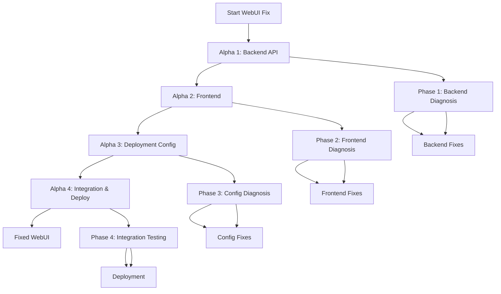

<!--
@doc-meta {
  "id": "alpha-plan",
  "version": "1.0",
  "last_updated": "2025-03-18",
  "update_frequency": "with-changes",
  "maintainer": "system",
  "status": "current",
  "category": "project_plan"
}
-->

# DockerForge WebUI Fix: Alpha Plan

This plan outlines a systematic approach to diagnosing and fixing the broken DockerForge WebUI. It's structured in 4 phases, each with specific prompts that can be executed independently.

## Alpha 1: Backend API Diagnosis and Fixes

### Phase 1 Prompt
```
I need to diagnose and fix the backend API issues in the DockerForge WebUI. Please help me with the following:

1. Check the FastAPI application structure in src/web/api/
2. Verify all the model implementations in src/web/api/models/
3. Test the database connection in src/web/api/database.py
4. Check the API routers in src/web/api/routers/
5. Test the API endpoints for appropriate responses
6. Fix any identified issues in the backend

Start by examining the directory structure and key files to understand the architecture, then diagnose specific issues with the backend API.
```

### Expected Outputs
- Identified backend API issues
- Fixed model implementations
- Repaired database connections
- Working API endpoints

## Alpha 2: Frontend Diagnosis and Fixes

### Phase 2 Prompt
```
I need to diagnose and fix the frontend issues in the DockerForge WebUI. Please help me with the following:

1. Examine the Vue.js application structure in src/web/frontend/
2. Check the frontend build process in package.json
3. Verify the main.js configuration and component imports
4. Inspect the router.js and store.js for proper configuration
5. Test the API integration from the frontend services
6. Fix any identified issues in the frontend code

Start by examining the frontend architecture and build process, then identify and fix specific issues with the Vue.js application.
```

### Expected Outputs
- Identified frontend issues
- Fixed JavaScript errors
- Repaired API integrations
- Working frontend components and routes

## Alpha 3: Deployment Configuration Fixes

### Phase 3 Prompt
```
I need to diagnose and fix the deployment configuration issues for the DockerForge WebUI. Please help me with the following:

1. Check how static files are being served in the FastAPI backend
2. Verify the Docker configuration in docker-compose.yml and Dockerfile
3. Check environment variables used by the application
4. Test the full application workflow
5. Fix any identified deployment configuration issues

Start by examining how the application is deployed and configured, then identify and fix specific issues with the deployment setup.
```

### Expected Outputs
- Identified deployment issues
- Fixed static file serving
- Repaired Docker configuration
- Working environment setup

## Alpha 4: Integration Testing and Deployment

### Phase 4 Prompt
```
I need to perform integration testing and deploy the fixed DockerForge WebUI. Please help me with the following:

1. Run the backend API and verify it's working correctly
2. Build and run the frontend and verify it's working correctly
3. Test the entire application end-to-end
4. Create a deployment plan for the fixed WebUI
5. Document any remaining issues or recommendations

Start by testing each component individually, then perform end-to-end testing and prepare for deployment.
```

### Expected Outputs
- Successful integration tests
- Working end-to-end application
- Deployment plan
- Documentation of fixes and recommendations

## Implementation Workflow



## Usage Instructions

To execute a specific phase of this plan, start a new prompt and use the format:
```
start alpha X phase Y
```

For example:
- To start the first phase: `start alpha 1 phase 1`
- To start the second phase: `start alpha 2 phase 2`

Each phase can be run independently, but it's recommended to complete them in sequence for a comprehensive fix.

<!-- 
@llm-instructions
This document outlines the Alpha plan for fixing the DockerForge WebUI.
- Keep the phase prompts exactly as written to maintain compatibility with existing automation
- Update the expected outputs if additional outputs are identified during implementation
- The implementation workflow diagram should be kept up-to-date with the latest process
- Do not modify the usage instructions format as it may be used programmatically
-->
