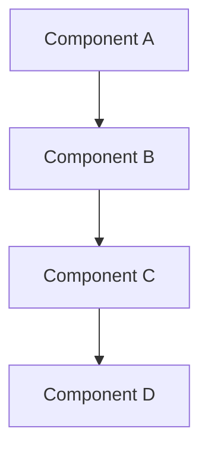

<!--
@doc-meta {
  "id": "project-plan-template",
  "version": "1.0",
  "last_updated": "2025-03-18",
  "update_frequency": "as-needed",
  "maintainer": "system",
  "status": "current",
  "category": "project_plan"
}
-->

# [Project Name] Project Plan

## Project Overview

**Status:** [Planning | Active | Completed | On Hold]  
**Start Date:** YYYY-MM-DD  
**Target Completion:** YYYY-MM-DD  
**Project Lead:** [Name/Team]

### Project Description

[A concise description of the project, its goals, and expected outcomes. This should provide context for anyone unfamiliar with the project.]

### Business Justification

[Explain why this project is important, what problems it solves, and the benefits it will bring to users.]

## Implementation Phases

### Phase 1: [Phase Name]

#### Objectives
- [Objective 1]
- [Objective 2]
- [Objective 3]

#### Implementation Steps
1. [Step 1]
2. [Step 2]
3. [Step 3]

#### Deliverables
- [Deliverable 1]
- [Deliverable 2]

#### Timeline
- Start: YYYY-MM-DD
- End: YYYY-MM-DD

### Phase 2: [Phase Name]

[Repeat the structure from Phase 1]

## Technical Details

### Architecture Changes

[Describe any architectural changes required for this project, including diagrams if helpful.]

### API Changes

[Document any API changes, additions, or deprecations.]

### Database Changes

[Document any database schema changes or migrations.]

## Testing Strategy

### Test Cases

[Outline the key test cases that will be used to validate the implementation.]

### Testing Environments

[Describe the environments where testing will occur.]

## Deployment Strategy

[Explain how the changes will be deployed to production, including any phased rollout plans.]

## Risk Assessment

| Risk | Impact | Likelihood | Mitigation |
|------|--------|------------|------------|
| [Risk 1] | [High/Medium/Low] | [High/Medium/Low] | [Mitigation strategy] |
| [Risk 2] | [High/Medium/Low] | [High/Medium/Low] | [Mitigation strategy] |

## Success Criteria

[Define clear, measurable criteria that will be used to determine if the project is successful.]

## Dependencies

[List any dependencies on other projects, teams, or external factors.]

## Team Resources

[List the team members and their roles for this project.]

## References

[Include links to related documentation, research, or other relevant materials.]

<!-- @llm-update-section
This template should be used as a starting point for new project plans.
Customize sections as needed based on the specific project requirements.
Remove any sections that are not applicable to the project.
-->

<!-- 
@llm-instructions
This is a template for new project plans.
- This template should not be modified directly
- Copy this template as a starting point for new project plans
- Update all placeholder text (indicated by [brackets])
- Remove any sections that don't apply to the specific project
- Add project-specific sections as needed
-->
