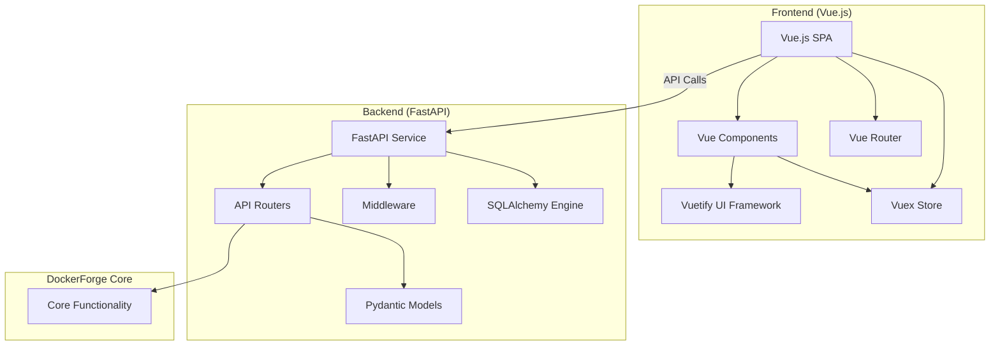
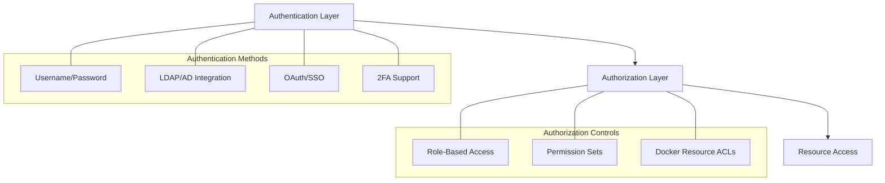

# DockerForge Web UI Implementation Plan

**Date:** March 16, 2025  
**Version:** 1.0  
**Status:** Draft  

## Table of Contents

1. [Overview](#overview)
2. [Architecture](#architecture)
3. [Technology Stack](#technology-stack)
4. [Implementation Phases](#implementation-phases)
5. [Security Considerations](#security-considerations)
6. [API Endpoints](#api-endpoints)
7. [UI Components](#ui-components)
8. [Deployment Strategy](#deployment-strategy)
9. [Timeline](#timeline)
10. [Dependencies](#dependencies)

## Overview

This document outlines the implementation plan for adding a web-based user interface to DockerForge. The web UI will provide a modern, intuitive interface for managing Docker containers, images, volumes, and networks, as well as accessing DockerForge's monitoring, security, and backup features.

The implementation will follow an API-First approach, with a FastAPI backend and Vue.js frontend. This approach offers several advantages:

- Clear separation between backend and frontend
- High-performance API with automatic documentation
- Modern, responsive user interface
- Scalability and maintainability

## Architecture



### Key Components

1. **FastAPI Backend**
   - RESTful API endpoints for all DockerForge functionality
   - JWT-based authentication and authorization
   - Database models and schemas
   - Integration with existing DockerForge core functionality

2. **Vue.js Frontend**
   - Single-page application (SPA)
   - Responsive UI with Vuetify components
   - State management with Vuex
   - Routing with Vue Router
   - Visualizations with Chart.js and D3.js

3. **Database**
   - PostgreSQL for persistent storage
   - SQLAlchemy ORM for database operations
   - Alembic for database migrations

4. **WebSockets**
   - Real-time updates for container status
   - Live log streaming
   - Notifications and alerts

## Technology Stack

### Backend
- **Primary Framework**: FastAPI
- **ORM**: SQLAlchemy with Async support
- **Database**: PostgreSQL
- **Authentication**: JWT tokens
- **API Documentation**: OpenAPI/Swagger UI (built into FastAPI)
- **WebSockets**: FastAPI WebSockets for real-time features
- **Validation**: Pydantic (built into FastAPI)
- **Testing**: pytest, pytest-asyncio

### Frontend
- **JavaScript Framework**: Vue.js 3
- **UI Framework**: Vuetify 3
- **State Management**: Vuex 4
- **Routing**: Vue Router 4
- **HTTP Client**: Axios
- **Visualization**: Chart.js, D3.js
- **Forms**: VeeValidate
- **Internationalization**: Vue I18n
- **Testing**: Jest, Vue Test Utils

### DevOps
- **Database**: PostgreSQL in Docker
- **Cache**: Redis for API caching
- **Containerization**: Docker
- **CI/CD**: GitHub Actions
- **Monitoring**: Prometheus integration

## Implementation Phases

### Phase 1: FastAPI Backend & Core API (Weeks 1-5)

#### 1. Project Setup (Week 1)
- Set up FastAPI project structure in `src/web/api/`
- Configure settings with environment variables
- Set up PostgreSQL database
- Implement JWT-based authentication
- Configure CORS and security middleware
- Add FastAPI dependencies to requirements.txt
- Update docker-compose.yml to include web service on port 54321

#### 2. Data Models & Database (Week 2)
- Design SQLAlchemy models and Pydantic schemas
- Implement database migrations with Alembic
- Create models for:
  - Users & Roles
  - Containers
  - Images
  - Volumes
  - Networks
  - Compose Files
  - Security Scans
  - Backup Records
  - Monitoring Data
  - Alerts & Notifications

#### 3. Core API Endpoints (Weeks 3-4)
- Implement Docker service layer
- Build RESTful endpoints for:
  - Authentication (login, logout, refresh tokens)
  - User management
  - Container operations (list, inspect, create, start, stop, etc.)
  - Image management
  - Volume management
  - Network management
  - Log retrieval
  - Docker Compose operations
  - Security scanning
  - Backup & restore operations
  - Monitoring metrics

#### 4. API Documentation & Testing (Week 5)
- Implement comprehensive API documentation with OpenAPI/Swagger
- Write API tests using pytest
- Set up CI/CD pipeline for API testing
- Implement API rate limiting and throttling

### Phase 2: Vue.js Frontend (Weeks 6-10)

#### 5. Vue Project Setup (Week 6)
- Set up Vue.js project with Vue CLI in `src/web/frontend/`
- Configure Vuetify for UI components
- Set up Vue Router for navigation
- Implement Vuex store for state management
- Create authentication flow (login, logout, token refresh)

#### 6. Core UI Components (Week 7)
- Design and implement reusable UI components:
  - Navigation sidebar
  - Dashboard widgets
  - Data tables with filtering and sorting
  - Cards and info panels
  - Form components
  - Modal dialogs
  - Notification system

#### 7. Container & Image Management UI (Week 8)
- Container list and detail views
- Container creation and management
- Image list and detail views
- Image pulling and building
- Volume and network management

#### 8. Visualization & Monitoring UI (Week 9)
- Dashboard overview with key metrics
- Resource usage charts with Chart.js
- Container performance visualizations
- Log viewer with filtering and search
- Advanced visualizations with D3.js for resource monitoring

#### 9. Security & Backup UI (Week 10)
- Security scanning interface
- Vulnerability visualization
- Backup management UI
- Restore functionality
- Settings and configuration panels

### Phase 3: Integration & Advanced Features (Weeks 11-14)

#### 10. WebSockets for Real-Time Updates (Week 11)
- Implement WebSocket support in FastAPI
- Add real-time container status updates
- Implement live log streaming
- Create real-time notifications

#### 11. Advanced Security Features (Week 12)
- Implement role-based access control
- Add two-factor authentication
- Set up audit logging
- Add session management

#### 12. Performance Optimization (Week 13)
- Optimize API queries
- Implement caching (Redis)
- Add pagination for large datasets
- Optimize Vue components for performance
- Lazy-loading for code splitting

#### 13. Deployment & Documentation (Week 14)
- Update docker-compose.yml for production deployment
- Create production Dockerfile
- Write comprehensive documentation
- Implement integration tests
- Create user guide for the web UI

## Security Considerations

Security is especially critical for DockerForge's web UI since it manages Docker containers that have significant system access. The following security measures will be implemented:

### 1. Authentication and Authorization



- **Strong Authentication**
  - Enforce strong password policies
  - Implement multi-factor authentication (2FA)
  - Option for LDAP/Active Directory integration
  - Consider OAuth/SSO for enterprise environments

- **Granular Authorization**
  - Role-based access control (Admin, Operator, Viewer)
  - Container/image specific permissions
  - Action-based permissions (view, start/stop, delete, etc.)
  - IP-based access restrictions

- **Session Management**
  - Secure, HTTP-only cookies with SameSite attribute
  - Short session timeouts with automatic logout
  - Session regeneration on privilege level change
  - Concurrent session limitations

### 2. API Security

- **Token-based Authentication**
  - Use JWT for authentication
  - Short-lived access tokens with refresh capability
  - Include token scope limitations

- **API Rate Limiting**
  - Implement rate limiting to prevent abuse
  - Account-based and IP-based throttling
  - Graduated response (warning, temporary block, permanent block)

- **Input Validation**
  - Strict validation for all API inputs using Pydantic
  - Parameter type checking and sanitization
  - Reject unexpected or malformed parameters

### 3. Docker-Specific Concerns

- **Privilege Separation**
  - Web UI should never run as root
  - Limit Docker socket permissions
  - Use Docker API instead of direct shell commands

- **Command Injection Prevention**
  - No direct passing of user input to Docker commands
  - Whitelist approach to container operations
  - Parameter binding instead of string concatenation

- **Resource Limitations**
  - Enforce container resource constraints
  - Prevent container escape vectors
  - Implement quota systems for users/teams

### 4. Data Security

- **Secrets Management**
  - Secure storage of API keys and credentials
  - Encrypted fields for sensitive data
  - Consider integration with vault solutions (HashiCorp Vault)

- **Data Encryption**
  - TLS/HTTPS for all communications
  - Encrypt sensitive data at rest
  - Secure key management

- **Backup Protection**
  - Encryption for all backups
  - Access controls on backup files
  - Secure deletion practices

### 5. Infrastructure Security

- **Docker Socket Protection**
  - Never expose Docker socket to public networks
  - Use TLS mutual authentication for Docker API
  - Consider using a proxy in front of the Docker API

- **Network Isolation**
  - Run web UI in isolated network
  - Implement proper network ACLs
  - Use internal Docker networks

- **Container Hardening**
  - Use minimal base images
  - Regular security updates
  - Runtime protection (e.g., AppArmor, Seccomp)

### 6. Security Monitoring and Auditing

- **Comprehensive Logging**
  - Audit logs for all administrative actions
  - Authentication success/failure logging
  - Container operation logging

- **Intrusion Detection**
  - Monitor for suspicious activities
  - Failed login attempt tracking
  - Unusual container operation patterns

- **Security Reporting**
  - Regular security scan reports
  - Compliance reporting
  - User activity reports

### 7. Development Security Practices

- **Secure SDLC**
  - Code reviews with security focus
  - Regular dependency scanning
  - Security-focused testing

- **Security Headers**
  - Implement Content-Security-Policy
  - Use Strict-Transport-Security
  - Add X-Content-Type-Options, X-Frame-Options

- **CSRF Protection**
  - Origin validation
  - SameSite cookie attributes

## API Endpoints

The following API endpoints will be implemented:

### Authentication
- `POST /api/auth/login` - User login
- `POST /api/auth/logout` - User logout
- `POST /api/auth/refresh` - Refresh access token
- `GET /api/auth/me` - Get current user info

### Users
- `GET /api/users` - List users
- `GET /api/users/{user_id}` - Get user details
- `POST /api/users` - Create user
- `PUT /api/users/{user_id}` - Update user
- `DELETE /api/users/{user_id}` - Delete user
- `GET /api/users/{user_id}/activity` - Get user activity

### Containers
- `GET /api/containers` - List containers
- `GET /api/containers/{container_id}` - Get container details
- `POST /api/containers` - Create container
- `DELETE /api/containers/{container_id}` - Remove container
- `POST /api/containers/{container_id}/start` - Start container
- `POST /api/containers/{container_id}/stop` - Stop container
- `POST /api/containers/{container_id}/restart` - Restart container
- `GET /api/containers/{container_id}/logs` - Get container logs
- `GET /api/containers/{container_id}/stats` - Get container stats
- `POST /api/containers/{container_id}/exec` - Execute command in container

### Images
- `GET /api/images` - List images
- `GET /api/images/{image_id}` - Get image details
- `POST /api/images/pull` - Pull image
- `POST /api/images/build` - Build image
- `DELETE /api/images/{image_id}` - Remove image
- `POST /api/images/{image_id}/tag` - Tag image

### Volumes
- `GET /api/volumes` - List volumes
- `GET /api/volumes/{volume_id}` - Get volume details
- `POST /api/volumes` - Create volume
- `DELETE /api/volumes/{volume_id}` - Remove volume

### Networks
- `GET /api/networks` - List networks
- `GET /api/networks/{network_id}` - Get network details
- `POST /api/networks` - Create network
- `DELETE /api/networks/{network_id}` - Remove network
- `POST /api/networks/{network_id}/connect` - Connect container to network
- `POST /api/networks/{network_id}/disconnect` - Disconnect container from network

### Compose
- `GET /api/compose` - List compose files
- `GET /api/compose/{compose_id}` - Get compose file details
- `POST /api/compose` - Create compose file
- `PUT /api/compose/{compose_id}` - Update compose file
- `DELETE /api/compose/{compose_id}` - Delete compose file
- `POST /api/compose/{compose_id}/up` - Start services
- `POST /api/compose/{compose_id}/down` - Stop services
- `GET /api/compose/{compose_id}/ps` - List services

### Security
- `GET /api/security/scans` - List security scans
- `POST /api/security/scans` - Run security scan
- `GET /api/security/scans/{scan_id}` - Get scan details
- `GET /api/security/vulnerabilities` - List vulnerabilities
- `GET /api/security/audits` - List security audits
- `POST /api/security/audits` - Run security audit

### Backup
- `GET /api/backup` - List backups
- `POST /api/backup/container/{container_id}` - Backup container
- `POST /api/backup/image/{image_id}` - Backup image
- `POST /api/backup/volume/{volume_id}` - Backup volume
- `POST /api/backup/{backup_id}/restore` - Restore backup
- `DELETE /api/backup/{backup_id}` - Delete backup

### Monitoring
- `GET /api/monitoring/metrics` - Get system metrics
- `GET /api/monitoring/containers/{container_id}/metrics` - Get container metrics
- `GET /api/monitoring/alerts` - List alerts
- `POST /api/monitoring/alerts` - Create alert
- `GET /api/monitoring/dashboard` - Get dashboard data

### WebSockets
- `WS /api/ws/containers` - Container status updates
- `WS /api/ws/logs/{container_id}` - Live container logs
- `WS /api/ws/notifications` - Real-time notifications

## UI Components

The web UI will consist of the following key components:

### 1. Dashboard
- System overview with key metrics
- Container status summary
- Recent activity feed
- Resource usage charts
- Quick action buttons

### 2. Container Management
- Container list with filtering and sorting
- Container detail view
- Container creation form
- Container logs viewer
- Container stats visualization

### 3. Image Management
- Image list with filtering and sorting
- Image detail view
- Image pull form
- Image build form
- Tag management

### 4. Volume & Network Management
- Volume list and details
- Network list and details
- Creation forms
- Connection management

### 5. Compose Management
- Compose file list
- Compose file editor
- Service status view
- Compose visualization

### 6. Security Center
- Vulnerability dashboard
- Scan results viewer
- Audit reports
- Security recommendations

### 7. Backup & Restore
- Backup list
- Backup creation
- Restore interface
- Backup scheduling

### 8. Monitoring & Alerts
- Resource monitoring dashboard
- Performance graphs
- Alert configuration
- Log analysis

### 9. Settings & Administration
- User management
- Role management
- System configuration
- API key management

## Deployment Strategy

The web UI will be deployed as part of the DockerForge Docker Compose setup:

```yaml
services:
  # ... existing services
  
  web:
    build:
      context: .
      dockerfile: Dockerfile.web
    volumes:
      - ./src/web:/app/src/web
      - ./static:/app/static
      - ./media:/app/media
    ports:
      - "54321:54321"
    depends_on:
      - dockerforge
    environment:
      - DOCKERFORGE_API_URL=http://dockerforge:8080
    networks:
      - dockerforge-network
      
  db:
    image: postgres:15-alpine
    volumes:
      - postgres_data:/var/lib/postgresql/data
    environment:
      - POSTGRES_USER=dockerforge
      - POSTGRES_PASSWORD=dockerforge
      - POSTGRES_DB=dockerforge
    networks:
      - dockerforge-network
      
  redis:
    image: redis:alpine
    volumes:
      - redis_data:/data
    networks:
      - dockerforge-network
```

## Timeline

The complete implementation is estimated to take 14 weeks:

- **Phase 1 (Weeks 1-5)**: FastAPI Backend & Core API
- **Phase 2 (Weeks 6-10)**: Vue.js Frontend
- **Phase 3 (Weeks 11-14)**: Integration & Advanced Features

## Dependencies

### Backend Dependencies

```
fastapi>=0.95.0
uvicorn[standard]>=0.21.0
sqlalchemy>=2.0.0
alembic>=1.10.0
asyncpg>=0.27.0
pydantic>=2.0.0
python-jose[cryptography]>=3.3.0 # For JWT
passlib[bcrypt]>=1.7.4 # For password hashing
python-multipart>=0.0.5 # For form data
websockets>=11.0.0 # For WebSockets
redis>=4.5.0 # For caching
```

### Frontend Dependencies

```json
{
  "dependencies": {
    "vue": "^3.2.47",
    "vuetify": "^3.1.0",
    "vuex": "^4.1.0",
    "vue-router": "^4.1.6",
    "axios": "^1.3.4",
    "chart.js": "^4.2.0",
    "d3": "^7.8.2",
    "vee-validate": "^4.8.0",
    "vue-i18n": "^9.2.0"
  },
  "devDependencies": {
    "@vue/cli-service": "^5.0.8",
    "@vue/test-utils": "^2.3.0",
    "jest": "^29.5.0"
  }
}
