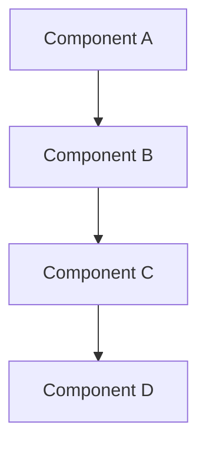

<!--
@doc-meta {
  "id": "project-plan-template",
  "version": "1.0",
  "last_updated": "2025-03-18",
  "update_frequency": "as-needed",
  "maintainer": "system",
  "status": "current",
  "category": "project-plan"
}
-->

# [Project Name] Project Plan

<!-- 
@llm-instructions
DOCUMENT PURPOSE: Template for creating new project plans
PRIMARY AUDIENCE: Project stakeholders and developers
MAINTENANCE PRIORITY: Medium (template for new projects)

MAINTENANCE GUIDELINES:
- This is a template that should be copied when creating new project plans
- Do not modify the template structure without updating all derived project plans
- Placeholders are indicated with [brackets] and should be replaced
- Optional sections are marked as such and can be removed if not applicable
- Required sections should not be removed from project plans
-->

## Project Overview

**Status:** [Planning | Active | Completed | On Hold]  
**Start Date:** [YYYY-MM-DD or TBD]  
**Target Completion:** [YYYY-MM-DD or TBD]  
**Project Lead:** [Name/Team]

### Project Description

[A concise description of the project, its goals, and expected outcomes. This should provide context for anyone unfamiliar with the project.]

### Business Justification

[Explain why this project is important, what problems it solves, and the benefits it will bring to users.]

## Implementation Phases

<!-- @llm-update-section
This section should be divided into logical phases of the project.
Each phase should have clear objectives, steps, deliverables, and timeline.
As the project progresses, update status information for each phase.
-->

### Phase 1: [Phase Name]

**Status:** [Not Started | In Progress | Completed]

#### Objectives
- [Objective 1]
- [Objective 2]
- [Objective 3]

#### Implementation Steps
1. [Step 1]
2. [Step 2]
3. [Step 3]

#### Deliverables
- [Deliverable 1]
- [Deliverable 2]

#### Timeline
- Start: [YYYY-MM-DD or TBD]
- End: [YYYY-MM-DD or TBD]

### Phase 2: [Phase Name]

[Repeat the structure from Phase 1]

## Technical Details

<!-- @llm-technical-section
This section covers the technical aspects of the implementation.
It should be detailed enough for developers to understand what needs to be done.
Include code examples, API changes, database changes, etc. as relevant.
-->

### Architecture Changes

[Describe any architectural changes required for this project, including diagrams if helpful.]

### API Changes

[Document any API changes, additions, or deprecations.]

### Database Changes

[Document any database schema changes or migrations.]

## Testing Strategy

<!-- @llm-testing-section
This section should outline how the project will be tested.
Include test cases, testing environments, and any special testing considerations.
-->

### Test Cases

[Outline the key test cases that will be used to validate the implementation.]

### Testing Environments

[Describe the environments where testing will occur.]

## Deployment Strategy

<!-- @llm-deployment-section
This section should describe how the changes will be deployed.
Include any phased rollout plans, feature flags, or other deployment considerations.
-->

[Explain how the changes will be deployed to production, including any phased rollout plans.]

## Risk Assessment

<!-- @llm-risk-section
This section should identify potential risks and mitigation strategies.
Keep this updated throughout the project as new risks are identified.
-->

| Risk | Impact | Likelihood | Mitigation |
|------|--------|------------|------------|
| [Risk 1] | [High/Medium/Low] | [High/Medium/Low] | [Mitigation strategy] |
| [Risk 2] | [High/Medium/Low] | [High/Medium/Low] | [Mitigation strategy] |

## Success Criteria

<!-- @llm-criteria-section
This section defines what success looks like for this project.
Criteria should be specific, measurable, and testable.
-->

[Define clear, measurable criteria that will be used to determine if the project is successful.]

## Dependencies

<!-- @llm-dependencies-section
This section lists dependencies on other projects, teams, or external factors.
Update as dependencies change or are resolved.
-->

[List any dependencies on other projects, teams, or external factors.]

## Team Resources

<!-- @llm-resources-section
This section lists the team members and their roles for this project.
Update as team composition changes.
-->

[List the team members and their roles for this project.]

## References

<!-- @llm-references-section
This section includes links to related documentation or other relevant materials.
Update as new references become available.
-->

[Include links to related documentation, research, or other relevant materials.]

## Change Log

<!-- @llm-update-section
This section tracks significant changes to the project plan.
Keep in chronological order with newest changes at the top.
-->

| Date | Change | Author |
|------|--------|--------|
| [YYYY-MM-DD] | Initial project plan | [Author Name] |

<!-- 
@llm-conditional-instructions
IF PROJECT IS IN PLANNING STATUS:
- Focus on completing all sections with as much detail as possible
- Identify any missing information that needs to be gathered
- Highlight assumptions that need validation

IF PROJECT IS ACTIVE:
- Keep implementation phases updated with current status
- Update risk assessment based on challenges encountered
- Document any scope changes or timeline adjustments
- Track progress against success criteria

IF PROJECT IS COMPLETED:
- Document actual completion dates for all phases
- Add a project outcomes section comparing results to success criteria
- Capture lessons learned for future projects
- Ensure all documentation references are updated
-->
