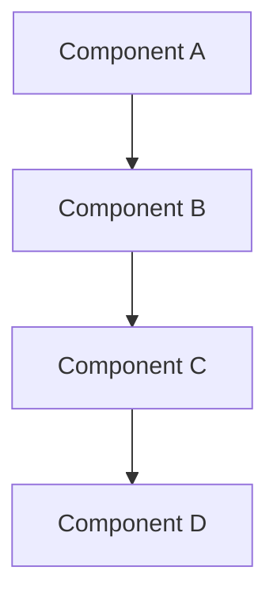

<!--
@doc-meta {
  "id": "[DOCUMENT_ID]",
  "version": "1.0",
  "last_updated": "[CURRENT_DATE]",
  "update_frequency": "with-project-progress",
  "maintainer": "system",
  "status": "current",
  "category": "project-plan"
}
-->

# [DOCUMENT_TITLE] Project Plan

<!-- 
@llm-instructions
DOCUMENT PURPOSE: Define project scope, schedule, and implementation details
PRIMARY AUDIENCE: Project stakeholders, developers, and managers
MAINTENANCE PRIORITY: High (critical project planning document)

MAINTENANCE GUIDELINES:
- Update status information as the project progresses
- Keep timelines accurate and updated
- Maintain implementation details in sync with actual development
- Document all decisions and their rationales
- Track changes to requirements or scope
- Keep the risk assessment current
-->

## Project Overview

<!-- @llm-update-section
This section provides a high-level description of the project.
- Update when project scope or objectives change
- Keep the status field current
- Update dates as they become more certain
-->

**Status:** [Planning | Active | Completed | On Hold]  
**Start Date:** [YYYY-MM-DD or TBD]  
**Target Completion:** [YYYY-MM-DD or TBD]  
**Project Lead:** [Name/Team]

### Project Description

[A concise description of the project, its goals, and expected outcomes. This should provide context for anyone unfamiliar with the project.]

### Business Justification

[Explain why this project is important, what problems it solves, and the benefits it will bring to users or the organization.]

## Implementation Phases

<!-- @llm-reasoning-guide
When updating project phases:
1. First determine the current status of each phase
2. Update status information accurately
3. If timeline changes, update all affected phases
4. If scope changes, update objectives and deliverables
5. If phases are added or removed, maintain the overall structure
6. Ensure dependencies between phases are preserved
-->

### Phase 1: [Phase Name]

**Status:** [Not Started | In Progress | Completed]

#### Objectives
- [Objective 1]
- [Objective 2]
- [Objective 3]

#### Implementation Steps
1. [Step 1]
2. [Step 2]
3. [Step 3]

#### Deliverables
- [Deliverable 1]
- [Deliverable 2]

#### Timeline
- Start: [YYYY-MM-DD or TBD]
- End: [YYYY-MM-DD or TBD]

### Phase 2: [Phase Name]

[Repeat the structure from Phase 1]

## Technical Details

<!-- @llm-technical-section
This section covers the technical aspects of the implementation.
- Update when technical approach changes
- Keep code examples and diagrams accurate
- Include implementation details for developers
-->

### Architecture Changes

[Describe any architectural changes required for this project, including diagrams if helpful.]

### API Changes

[Document any API changes, additions, or deprecations.]

### Database Changes

[Document any database schema changes or migrations.]

## Testing Strategy

<!-- @llm-testing-section
This section should outline how the project will be tested.
- Update as testing approach evolves
- Include additional test cases as needed
- Update to reflect changes in testing environments
-->

### Test Cases

[Outline the key test cases that will be used to validate the implementation.]

### Testing Environments

[Describe the environments where testing will occur.]

## Deployment Strategy

<!-- @llm-deployment-section
This section should describe how the changes will be deployed.
- Update deployment plan as it evolves
- Include rollback procedures
- Document any special deployment considerations
-->

[Explain how the changes will be deployed to production, including any phased rollout plans.]

## Risk Assessment

<!-- @llm-risk-section
This section should identify potential risks and mitigation strategies.
- Update as new risks are identified
- Track risk status and effectiveness of mitigations
- Adjust impact and likelihood assessments as the project progresses
-->

| Risk | Impact | Likelihood | Mitigation |
|------|--------|------------|------------|
| [Risk 1] | [High/Medium/Low] | [High/Medium/Low] | [Mitigation strategy] |
| [Risk 2] | [High/Medium/Low] | [High/Medium/Low] | [Mitigation strategy] |

## Success Criteria

<!-- @llm-criteria-section
This section defines what success looks like for this project.
- Update if success criteria change
- Add metrics for measuring success
- Reference specific objectives from Project Overview
-->

[Define clear, measurable criteria that will be used to determine if the project is successful.]

## Dependencies

<!-- @llm-dependencies-section
This section lists dependencies on other projects, teams, or external factors.
- Update as dependencies are resolved or added
- Track status of each dependency
- Include contingency plans for critical dependencies
-->

[List any dependencies on other projects, teams, or external factors.]

## Team Resources

<!-- @llm-resources-section
This section lists the team members and their roles for this project.
- Update as team composition changes
- Include resource allocation information
- Track availability of key team members
-->

[List the team members and their roles for this project.]

## References

<!-- @llm-references-section
This section includes links to related documentation or other relevant materials.
- Update as new references become available
- Ensure links remain valid
- Include both internal and external references
-->

[Include links to related documentation, research, or other relevant materials.]

## Change Log

<!-- @llm-update-section
This section tracks significant changes to the project plan.
- New entries should be added at the top (newest first)
- Include date, description, and who made the change
- Reference specific sections that were modified
-->

| Date | Change | Author |
|------|--------|--------|
| [CURRENT_DATE] | Initial project plan | [Author] |

<!-- 
@llm-conditional-instructions
IF PROJECT IS IN PLANNING STATUS:
- Focus on completing all sections with as much detail as possible
- Identify any missing information that needs to be gathered
- Highlight assumptions that need validation

IF PROJECT IS ACTIVE:
- Keep implementation phases updated with current status
- Update risk assessment based on challenges encountered
- Document any scope changes or timeline adjustments
- Track progress against success criteria

IF PROJECT IS COMPLETED:
- Document actual completion dates for all phases
- Add a project outcomes section comparing results to success criteria
- Capture lessons learned for future projects
- Ensure all documentation references are updated
-->
